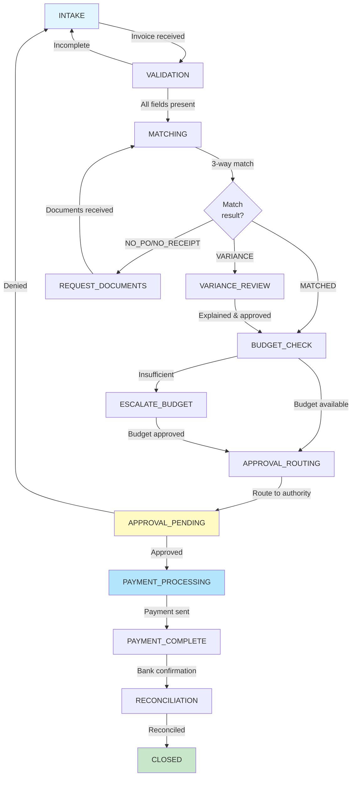
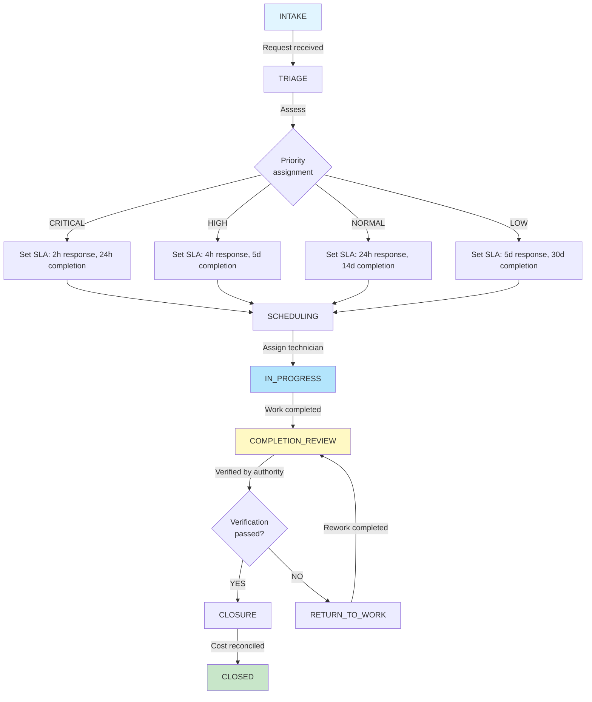
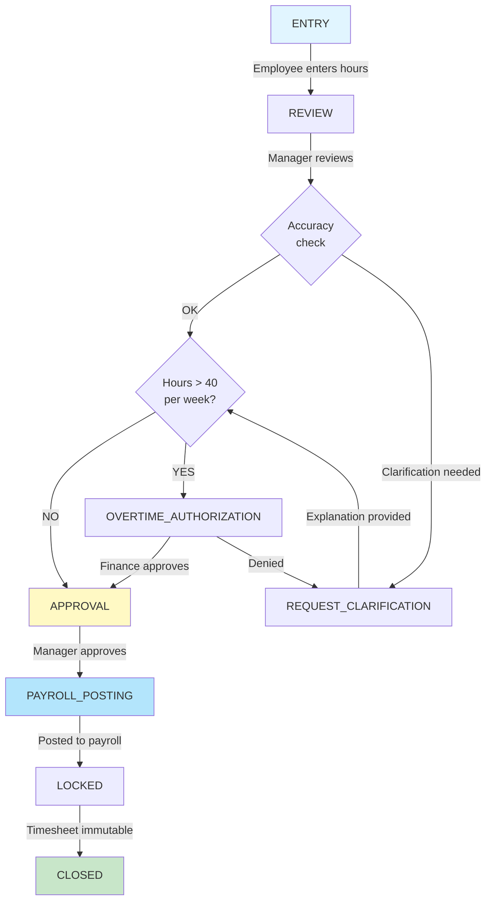
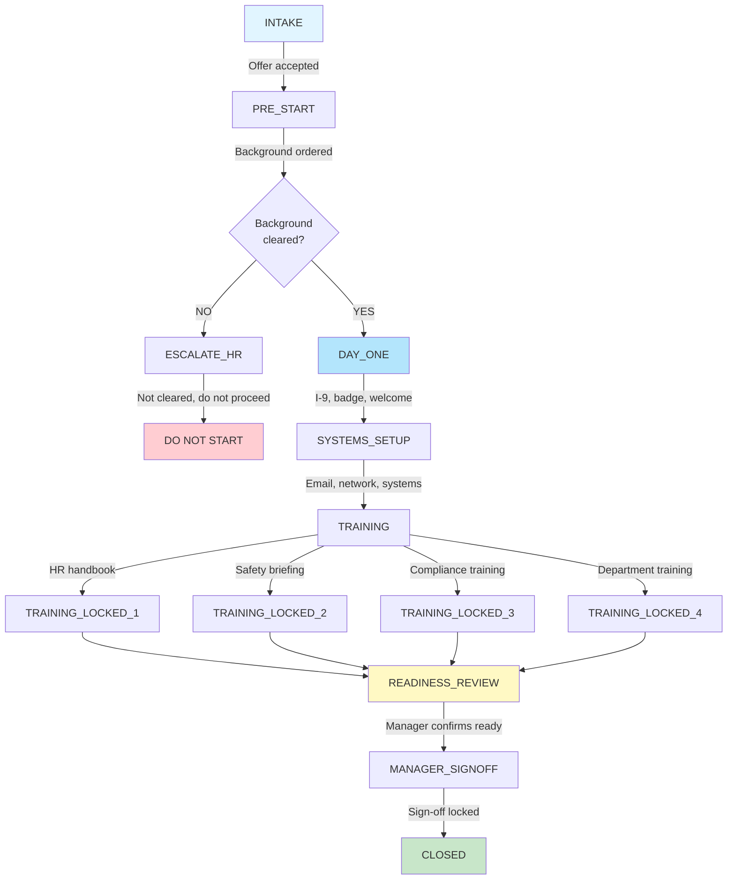

# VAULT Module Process Flowcharts

**Visual State Machine Diagrams • Version 1.0**

---

## FISCAL Module Flowchart

---

## FIX Module Flowchart

---

## TIME Module Flowchart

---

## ONBOARD Module Flowchart

---

*All module process flowcharts with gate decisions and state transitions.*
