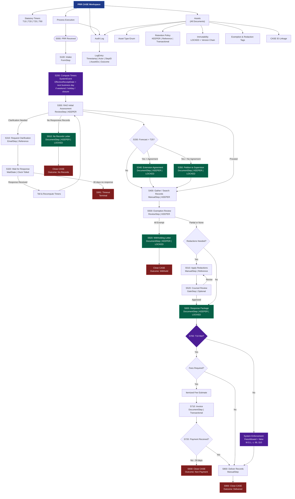

```mermaid
flowchart TB
    %% ==================================================
    %% VAULTPRR™ — Massachusetts Public Records Requests
    %% Canonical CASE-Based Architecture v1.0
    %% Authority: M.G.L. c. 66, §10 | 950 CMR 32.00
    %% ==================================================

    %% --------------------
    %% CORE CONTAINER
    %% --------------------
    CASE["PRR CASE Workspace"]:::core

    CASE --> TIMERS["Statutory Timers<br/>T10 | T20 | T25 | T90"]
    CASE --> ASSETS["Assets<br/>(All Documents)"]
    CASE --> LOG["Audit Log"]
    CASE --> PROCESS["Process Execution"]

    %% --------------------
    %% INTAKE & TIMER LOGIC
    %% --------------------
    PROCESS --> START([S000: PRR Received])
    START --> INTAKE["S100: Intake<br/>FormStep"]
    INTAKE --> CALC["S200: Compute Timers<br/>SystemEvent<br/>EffectiveReceiptDate = next business day<br/>if weekend / holiday / closure"]

    CALC --> ASSESS["S300: RAO Initial Assessment<br/>ReviewStep | KEEPER"]

    %% --------------------
    %% CLARIFICATION LOOP
    %% --------------------
    ASSESS -->|Clarification Needed| CLARIFY["S310: Request Clarification<br/>EmailStep | Reference"]
    CLARIFY --> WAIT["S320: Wait for Response<br/>WaitState | Clock Tolled"]
    WAIT -->|Response Received| TOLL["Toll & Recompute Timers"]
    TOLL --> ASSESS
    WAIT -->|30 days no response| TIMEOUT["S991: Timeout<br/>Terminal"]

    %% --------------------
    %% NO RECORDS PATH
    %% --------------------
    ASSESS -->|No Responsive Records| NOREC["S910: No Records Letter<br/>DocumentStep | KEEPER | LOCKED"]
    NOREC --> CLOSE_NO["Close CASE<br/>Outcome: No Records"]

    %% --------------------
    %% T25 FORECAST LOGIC
    %% --------------------
    ASSESS --> FORECAST{"S330: Forecast > T25?"}

    FORECAST -->|No| GATHER
    FORECAST -->|Yes + Agreement| AGREED["S340: Extension Agreement<br/>DocumentStep | KEEPER | LOCKED"]
    FORECAST -->|Yes + No Agreement| PETITION["S350: Petition to Supervisor<br/>DocumentStep | KEEPER | LOCKED"]

    AGREED --> GATHER
    PETITION --> GATHER

    %% --------------------
    %% SEARCH & REVIEW
    %% --------------------
    ASSESS -->|Proceed| GATHER["S400: Gather / Search Records<br/>ManualStep | KEEPER"]
    GATHER --> EXEMPT["S500: Exemption Review<br/>ReviewStep | KEEPER"]

    %% --------------------
    %% FULL WITHHOLDING
    %% --------------------
    EXEMPT -->|All Exempt| DENY["S920: Withholding Letter<br/>DocumentStep | KEEPER | LOCKED"]
    DENY --> CLOSE_DENY["Close CASE<br/>Outcome: Withheld"]

    %% --------------------
    %% PARTIAL / NO EXEMPTIONS
    %% --------------------
    EXEMPT -->|Partial or None| REDACT{"Redactions Needed?"}

    REDACT -->|Yes| APPLY["S510: Apply Redactions<br/>ManualStep | Reference"]
    APPLY --> LEGAL["S520: Counsel Review<br/>GateStep | Optional"]
    LEGAL -->|Revise| APPLY
    LEGAL -->|Approved| PACKAGE["S600: Response Package<br/>DocumentStep | KEEPER | LOCKED"]

    REDACT -->|No| PACKAGE

    %% --------------------
    %% T10 FEE ENFORCEMENT
    %% --------------------
    PACKAGE --> T10CHECK{"S700: T10 Met?"}

    T10CHECK -->|No| FEEWAIVE["System Enforcement:<br/>FeesAllowed = false<br/>M.G.L. c. 66, §10"]
    T10CHECK -->|Yes| FEES{"Fees Required?"}

    %% --------------------
    %% FEES PATH
    %% --------------------
    FEES -->|Yes| ESTIMATE["Itemized Fee Estimate"]
    ESTIMATE --> INVOICE["S710: Invoice<br/>DocumentStep | Transactional"]
    INVOICE --> PAYMENT{"S720: Payment Received?"}

    PAYMENT -->|No - 30 days| CLOSE_NONPAY["S930: Close CASE<br/>Outcome: Non-Payment"]
    PAYMENT -->|Yes| DELIVER["S800: Deliver Records<br/>ManualStep"]

    %% --------------------
    %% NO FEES PATH
    %% --------------------
    FEES -->|No| DELIVER
    FEEWAIVE --> DELIVER

    %% --------------------
    %% FINAL DELIVERY
    %% --------------------
    DELIVER --> CLOSE_OK["S900: Close CASE<br/>Outcome: Delivered"]

    %% --------------------
    %% AUDIT MODEL
    %% --------------------
    PROCESS --> LOG
    ASSETS --> LOG

    LOG --> AUDITFIELDS["LogEntry:<br/>Timestamp | Actor | StepID | AssetIDs | Outcome"]

    %% --------------------
    %% ASSET MODEL
    %% --------------------
    ASSETS --> ASSETTYPE["Asset Type Enum"]
    ASSETS --> RETENTION["Retention Policy<br/>KEEPER | Reference | Transactional"]
    ASSETS --> IMMUTABLE["Immutability<br/>LOCKED + Version Chain"]
    ASSETS --> TAGS["Exemption & Redaction Tags"]
    ASSETS --> CASEID["CASE ID Linkage"]

    %% --------------------
    %% STYLING
    %% --------------------
    classDef core fill:#1e3a8a,stroke:#60a5fa,color:#ffffff,font-weight:bold
    classDef terminal fill:#7f1d1d,stroke:#fca5a5,color:#ffffff
    classDef locked fill:#065f46,stroke:#6ee7b7,color:#ffffff
    classDef system fill:#4c1d95,stroke:#c4b5fd,color:#ffffff

    class CASE core
    class CLOSE_NO,CLOSE_DENY,CLOSE_NONPAY,CLOSE_OK,TIMEOUT terminal
    class NOREC,DENY,AGREED,PETITION,PACKAGE locked
    class CALC,T10CHECK,FEEWAIVE system
```
