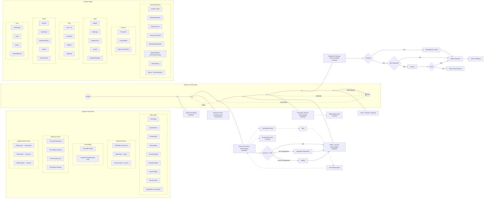

# VAULTPRR™ — System Architecture Diagram

**Canonical Domain Model & Control Spine**  
**Version 1.0**

---

---

## Reading This Diagram

**Three Rails:**

| Rail | Purpose |
|------|---------|
| **Left: Legend** | Vocabulary — step types, record classes, timers, implementation stack |
| **Center: Control Spine** | Abstract process flow — states and transitions |
| **Right: Domain Model** | Data structures — CASE, Process, Step, Path, Asset, Log |

**Lifecycle Attachment:** The center spine connects to concrete steps (Intake, Assessment, Gather, etc.) showing where domain entities are created and modified.

**Use this diagram for:** Understanding the system architecture — what entities exist, how they relate, what the control flow looks like at an abstract level.

**Use the Process Flowchart for:** Implementation — concrete states, transitions, decision gates, and validation rules.
