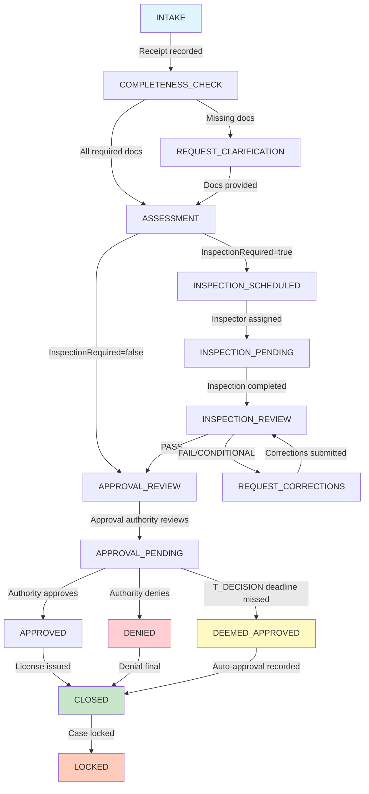
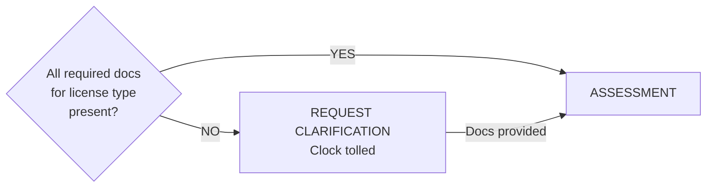
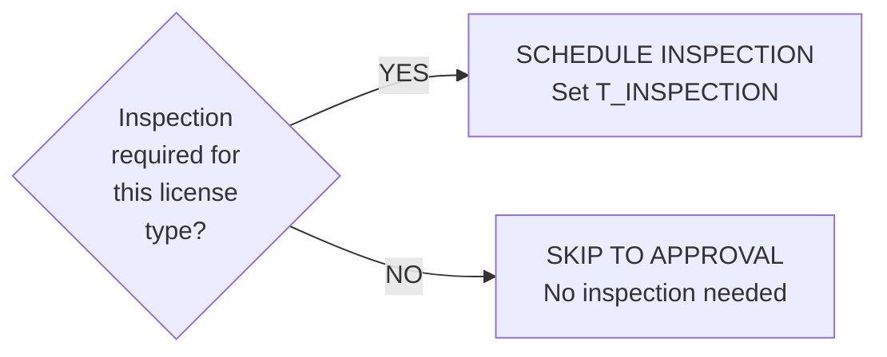
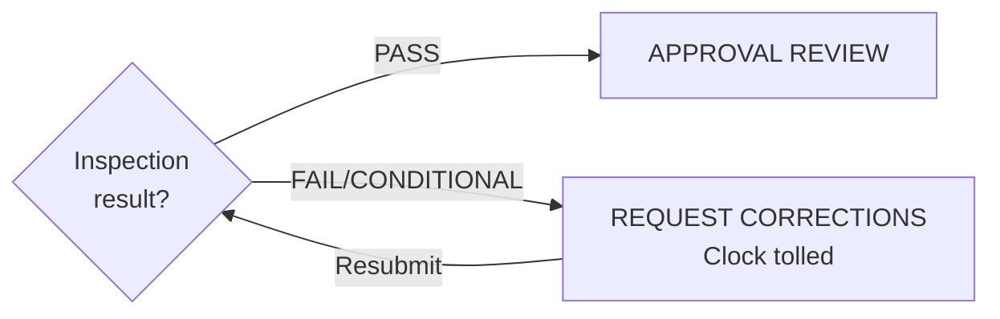
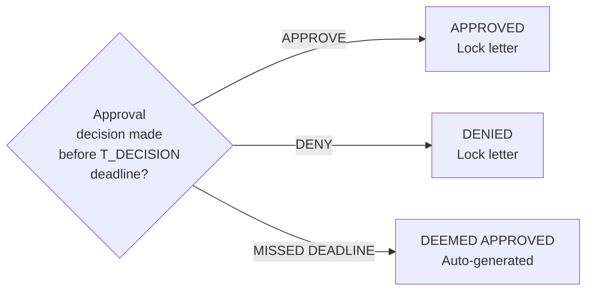

# VAULT CLERK™ — Process Flowchart

**State Machine Visualization • Version 1.0**

---

## CLERK Module State Machine (Mermaid)



---

## Gate Decision Points

### Gate: Completeness (B → C or D)



### Gate: Inspection Required (C → E or F)



### Gate: Inspection Results (H → F or I)



### Gate: Approval Decision (J → K, L, or M)



---

## Timeline Example: Contractor License

```
Day 0 (Jan 15): Application submitted
  └─ INTAKE → COMPLETENESS_CHECK
     ✓ Insurance document
     ✓ Bonding document
     ✓ Background check form
  
Day 1 (Jan 16): Completeness verified
  └─ COMPLETENESS_CHECK → ASSESSMENT
  
Day 2 (Jan 17): Inspection scheduled
  └─ ASSESSMENT → INSPECTION_SCHEDULED → INSPECTION_PENDING
     Inspector: Building Inspector Jones
     Date: Jan 19
  
Day 4 (Jan 19): Inspection conducted
  └─ INSPECTION_PENDING → INSPECTION_REVIEW
     Result: PASS
  
Day 5 (Jan 20): Approval reviewed
  └─ INSPECTION_REVIEW → APPROVAL_REVIEW → APPROVED
     Authority: Building Inspector Jones
     Approval recorded and LOCKED
  
Day 5 (Jan 20): License issued
  └─ APPROVED → CLOSED
     License Certificate generated (LOCKED)
     LicenseExpiry: Jan 20, 2027 (1 year)
     
T90 Window Opens: Jan 20 - Feb 19 (30 calendar days)
  Applicant can appeal if desired
```

---

## Error Paths

```
If T_INTAKE missed:
  INTAKE → REQUEST_CLARIFICATION (hard stop at deadline)
  
If T_DECISION missed:
  APPROVAL_REVIEW → DEEMED_APPROVED (automatic)
  ApprovalStatus = APPROVED
  License issued automatically
  
If Inspection fails:
  INSPECTION_REVIEW → REQUEST_CORRECTIONS (tolled)
  Clock paused until corrections submitted + re-inspection
```

---

*Process flowchart shows all states, transitions, gates, and conditions.*
